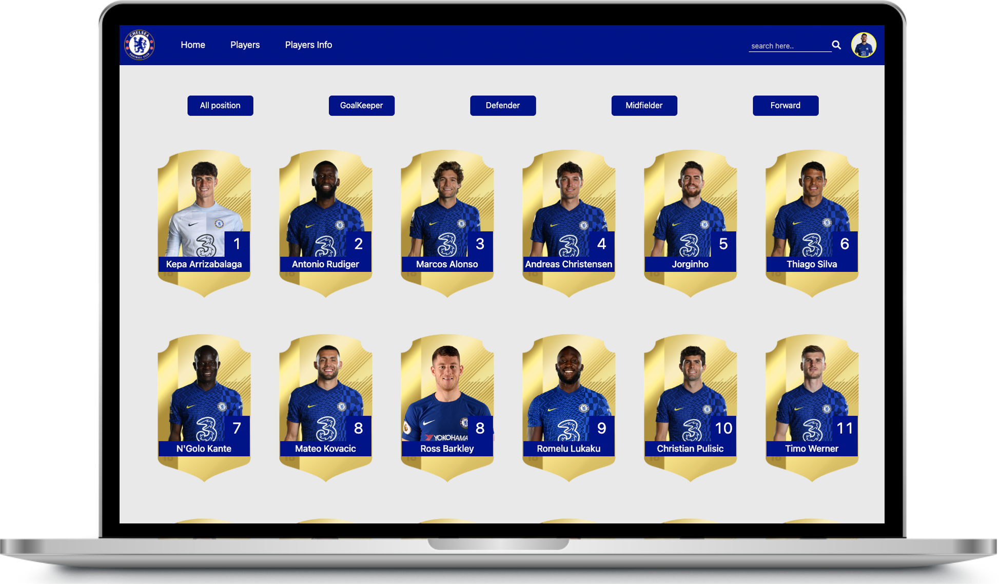

# Chelsea Players List (미완)

## 메인화면, RESULT

# 📑 프로젝트의 목적
1. React 를 이용해서 받아온 데이터로 선수의 정보를 반복 출력할 수 있는 구조 만들기
2. 포지션을 클릭하면 해당 포지션별로 선수들 목록 정렬시키기
3. 신규 선수가 있을 시 선수를 등록하기
4. 선수마다 댓글을 달아 사용자들간의 의견 나누기

# 🛠 사용된 기술 스택

- React
- 서버 및 DB: Fireabase(v9)
- UI 및 스타일: Sass, react-bootstrap, styled-components

# 🔵 주요 기능

### 1. 회원가입 및 로그인

Firebase 로 회원가입 및 로그인 구현

### 2.. 선수단 전체 조회 및 표지션별 정렬, 선수단 상세페이지 조회 (미완)

포지션 버튼 클릭시 해당 포지션별로 선수 리스트 정렬

### 3. 선수별 댓글 CRUD 및 댓글 좋아요 기능

Firebase DB 에 저장된 댓글 조회/작성/수정/삭제와 좋아요/취소 기능 구현

### 4. 선수 정보 신규 등록

Firebase DB 에 신규 선수 정보를 새로 등록하면 DB 에 저장되고 선수 리스트에 반영

### 5. 프로필 수정 기능

사용자의 닉네임과 프로필 이미지 수정사항을 Firebase DB 에 반영

# ✍️ 느낀점, 감상 

이전에 html, css, JS 로 첼시 리스트를 구현했던 것을 확장해서 파이어베이스 DB 에 저장되어 있는 선수 데이터를 컴포넌트로 반복출력하는 것을 해본 프로젝트였다. 파이어베이스로 간단한 회원가입과 로그인을 실습해볼 수 있었고, 어떻게 하나의 컴포넌트로 선수데이터를 반복출력할 지를 고민하여 만들었던 프로젝트였다. 미완성으로 끝났지만 꽤 의미가 깊은 프로젝트였다.
